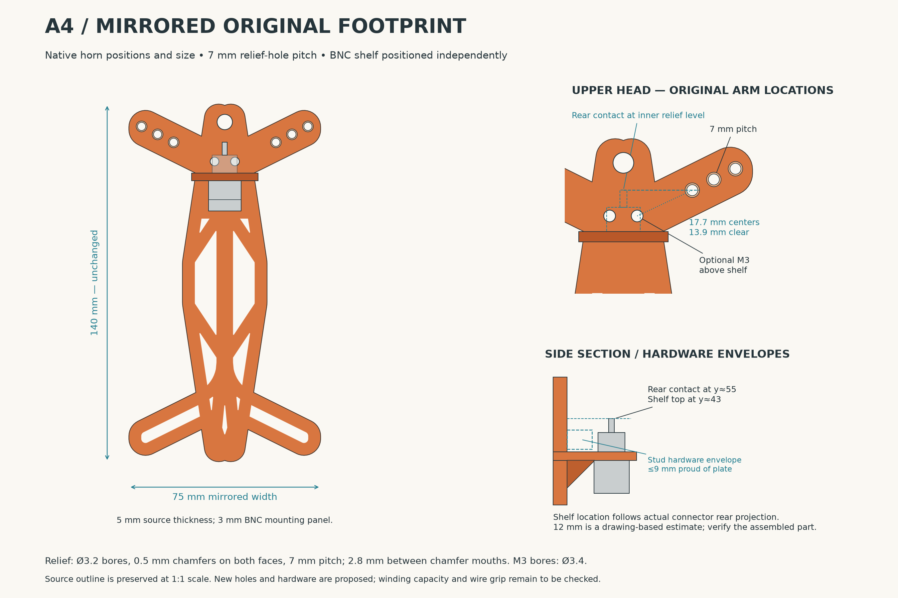
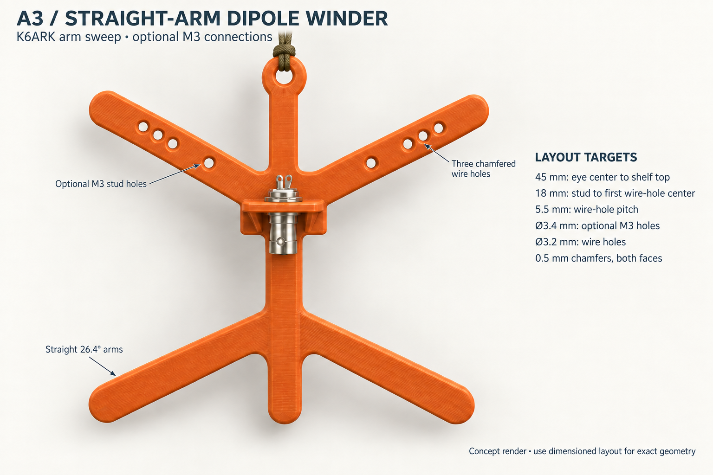
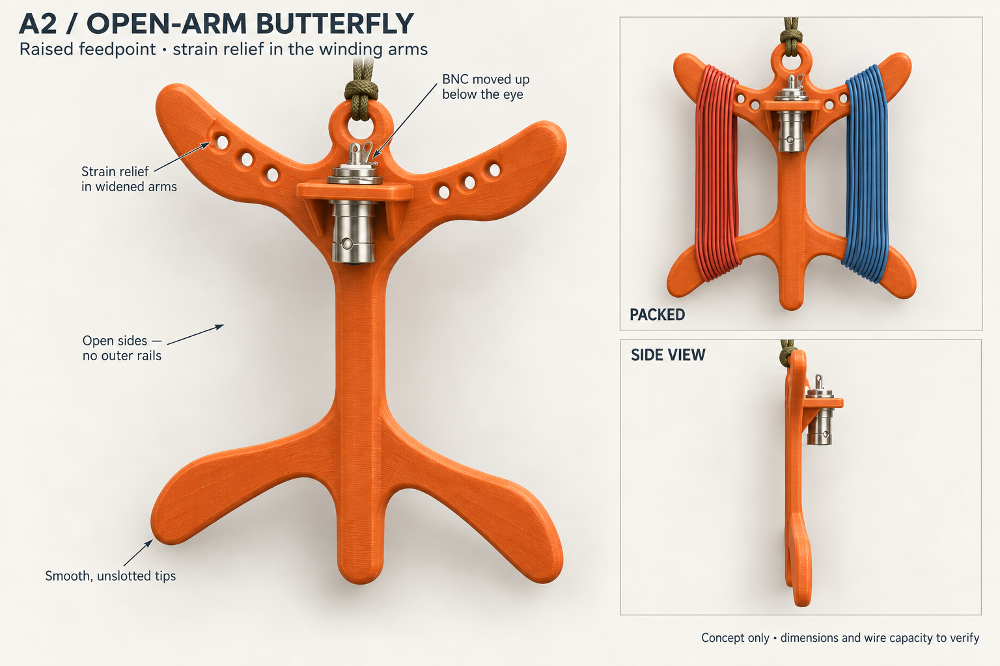
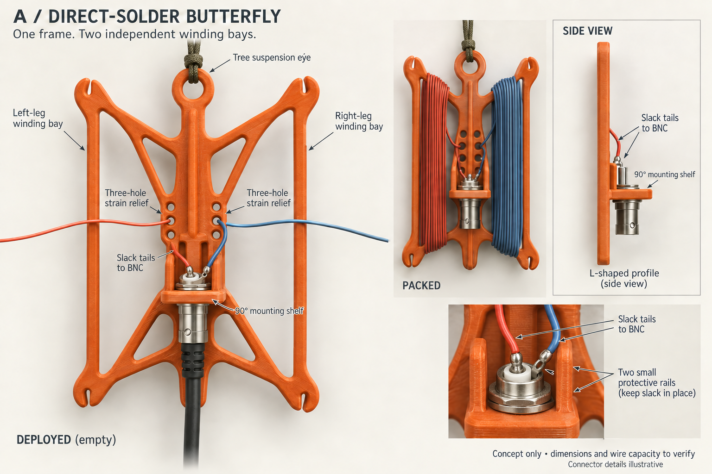
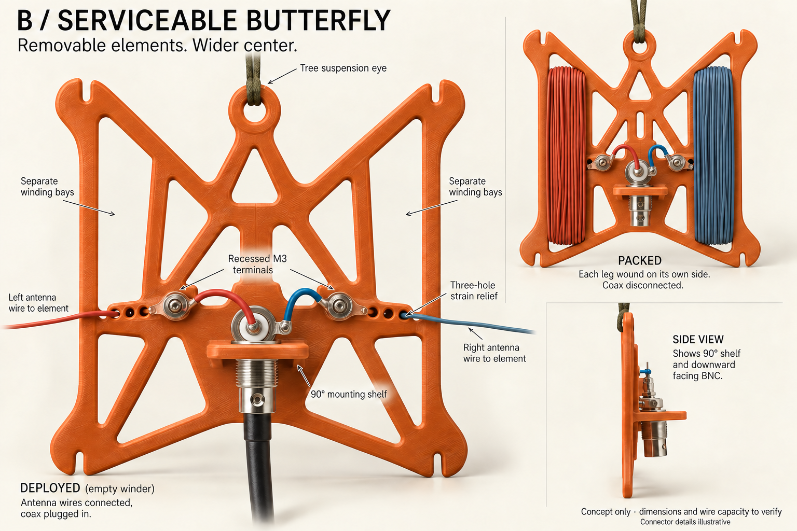

# Mirrored dipole winder concepts

Brainstorming mockups prepared 9 September 2026. Early images are industrial-design studies; A4 and A5 are measured, source-derived layouts. A5 is now implemented in the [dipole winder SCAD project](../../../models/ham_radio/dipole_winder/README.md), with a printable STL and rendered previews. The studies below preserve the design history.

## Current direction: A5, direct solder and compact BNC shelf

A5 preserves A4's **75 × 140 × 5 mm** mirrored source footprint, horn positions, suspension eye, and three relief holes per arm. The M3 holes and studs are removed. Each leg weaves through the frame and then has a slack tail soldered to the BNC center cup or shell tag.

The BNC moves **6 mm closer to the frame**, with its axis 10 mm from the front face and a 24 mm overall shelf depth. Its vertical position stays aligned with the inner relief holes. Relief remains **7 mm pitch, Ø3.2 bores, and 0.5 mm chamfers on both faces**. The [A5 notes](a5-design-notes.md) and [numeric layout](layout-a5.json) are the current inputs for SCAD; hardware dimensions remain provisional pending assembly fit.

## Earlier direction: A4, mirrored original footprint

A4 preserves the source winder dimensions and horn locations at scale 1. Mirroring across the original long-spine axis produces a **75 × 140 × 5 mm** frame. The eye stays in the existing top end; the BNC shelf moves independently to put its rear contact at the inner relief-hole level.

Use **7 mm relief-hole pitch**, with Ø3.2 bores and 0.5 mm chamfers on both faces. Optional Ø3.4 M3 bores have approximately **17.7 mm center spacing / 13.9 mm clear gap** to the first relief hole. The [A4 notes](a4-design-notes.md) record measured coordinates, fit conditions, and the provisional connector projection. This source-derived layout supersedes A3's resized outline and extended upper neck.

## Earlier direction: A3, straight arms and optional studs

A3 uses a measured 26.4° outward arm sweep from the two user-supplied K6ARK STLs, simple straight arms, a BNC shelf 45 mm below the eye center, and optional M3 holes with 18 mm to the first chamfered wire hole. This leaves 14.2 mm clear at the plate face, exceeding the requested 10 mm minimum. The 3.2 mm wire bores accommodate the repo's nominal 26 AWG jacket and the verified 22 AWG Poly-STEALTH example.

Use the [dimensioned A3 layout](layout-a3.png) for geometry. Full measurements, spacing calculations, wire-fit limits, and next-stage coordinates are in [A3 design notes](a3-design-notes.md). The [reference-angle figure](reference-angles.png) documents the measured original surfaces. Earlier concepts below are retained for comparison.

## Earlier direction: A2, open-arm butterfly

Revised after user feedback: move the BNC shelf up immediately below the suspension eye, widen the winding arms, put three strain-relief holes directly in each upper-arm shoulder, remove both outside vertical rails, and remove all four corner slits.

The two upper and two lower arms now have smooth, solid, rounded ends. A central spine connects the upper and lower sections; both outer sides remain open. The phrase "vertical bar" was interpreted as the outside rails in the earlier mockup. The retained central connection is explicit in this revision.

The upper-arm holes should sit in broad shoulders with a continuous band of material into the suspension head. Their placement should let antenna tension enter close to the head rather than bend the free horn tips. Reserve a smooth winding saddle farther out along each arm, with the relief holes and slack connector leads clear of the packed-wire envelope.

The high BNC keeps the wire tails short. Leave clearance between its rear nut/tag and the suspension cord, and retain compact shelf gussets plus access to the coax coupling. Each leg will weave through its three holes before a relaxed tail reaches the BNC center or shell connection. The main mockup intentionally leaves the holes unthreaded so their location is visible.

The deleted corner slits were intended as wire-end parking notches. They were not needed for the basic winding geometry; the revised design has no end-parking cuts.

This remains a visual concept. Dimensions, wire capacity, detailed threading, and hardware fit will be resolved during SCAD development.

## Earlier concept: A, direct-solder butterfly

Mirror a K6ARK-style skeletal winder across its long spine, then hang that spine vertically. The result has four swept horns: the upper/lower pair on the left stores one antenna leg, and the upper/lower pair on the right stores the other. An eye at the top end of the spine suspends the assembly. A small shelf at the center stands at 90 degrees to the broad frame and holds a downward-facing BNC.

Each wire should be mechanically anchored by a three-hole weave in the printed frame, with a short slack insulated tail to the BNC. One tail connects to the isolated center solder cup; the other connects to the shell solder tag. The connector does not provide the antenna-wire strain relief.

This version removes two terminal fastener stacks, ring terminals, and separate jumper connections. A2 retains its direct-solder approach while replacing the frame and moving the feedpoint.

## Earlier alternative: B, serviceable butterfly

Keep the same four-horn arrangement, but widen the central bridge to accommodate two recessed M3 terminal islands. Each antenna leg passes through its strain relief before reaching a ring terminal. Short jumpers connect the separate posts to the BNC center and shell.

This is useful if removing or replacing antenna legs at the center matters. The additional hardware and ring barrels require more clear space. With closed strain-relief holes, removing a ring from its post does not completely free the leg from the frame: the ring cannot pass through the holes. Do not describe this as a quick-release leg system without changing that detail.

## Shared design requirements for SCAD

- Keep the suspension eye inside the native upper end and the original horns fixed. Position only the BNC shelf to put its rear contact at the inner strain-relief level; tune shelf position from the actual connector projection.
- Print the broad frame flat, with the BNC shelf standing upright. Use a broad shelf root and small gussets inside the central hardware zone.
- Preserve two independent winding corridors with open outer sides and smooth, unslotted horn tips. Neither stored bundle should rub the BNC, solder tails, fasteners, or suspension cord.
- Put three chamfered strain-relief holes in each upper arm, preserving solid material into the suspension head and a separate smooth winding saddle. Lower arms have no strain-relief holes. A5 omits M3 holes and uses direct-solder tails.
- Route tree/antenna tension through the frame, then leave slack at the electrical joints. Pull/flex-test the three-hole relief with the actual insulated wire.
- Keep the repeatedly flexing region away from the end of solder wicking. Small protective rails around the relaxed leads may help; they should not obstruct soldering or winding.
- Check clearance with the complete BNC nut/tag/washer stack and actual coax plug, including finger access to its rotating coupling.
- Fully deploy the intended antenna elements for use. Wire shown packed on the frame is storage, not a validated band-selection method.
- This is an open dipole feedpoint. It does not incorporate a transformer or current choke.

## Known hardware and provisional dimensions

The existing [dipole center documentation](../../../models/ham_radio/dipole_center/README.md) identifies the owned hardware:

| Feature | Starting point / status |
| --- | --- |
| BNC | Amphenol RF 31-221-RFX |
| Nominal BNC cutout | D-shaped, 9.70 mm diameter, 8.85 mm flat-to-opposite-edge |
| Existing model's print allowance | 9.90 mm diameter, 9.05 mm flat-to-opposite-edge; physical fit pending |
| BNC shelf thickness | 3.0 mm; drawing maximum panel thickness 3.30 mm |
| BNC nut/tag clearance | Existing model uses an 18 mm diameter clearance envelope; verify actual stack and plug access |
| Main frame thickness | A5 preserves the source's 5 mm thickness |
| BNC axis / shelf depth | A5: z15 mm / 24 mm overall, bringing the connector 6 mm closer than A4 |
| Wire relief | Three 3.2 mm holes in each upper-arm shoulder, radiused/chamfered edges; adapt for actual wire |
| Antenna wire | DX Engineering DXE-SANTW-500, 26 AWG stranded copper-clad steel with PE insulation |
| Electrical termination | A5: direct solder to the BNC center cup and shell tag after the wire weave |

The concept prompts proposed an approximate 140 mm height and widths of 95 mm for A / 125 mm for B solely to communicate proportions. These sizes are **not measured from the resulting images**, and wire capacity is unverified. Before choosing final dimensions, establish longest leg length, actual insulated wire diameter, preferred winding motion, and whether linked elements/end insulators also need storage.

The generated connector details and visible wire threading are illustrative. Use the manufacturer drawing and an explicit wire-routing diagram during CAD/assembly design; do not infer a hardware layout from rendered metal shapes.

## References and provenance

- Inspiration: [K6ARK Wire Antenna Winder — UL Wireframe Model, Adam Kimmerly](https://www.printables.com/model/383037-k6ark-wire-antenna-winder-ul-wireframe-model).
- The initial concepts used a publicly visible [reference collection image](https://reflector.sota.org.uk/uploads/db9433/original/3X/9/1/915db220d94b8d6ea4583dd70175a5e1cd3ccedc.jpeg) because Printables blocked automated access. For A3, the user supplied the exact wireframe and solid STLs, which were analyzed without modification; [measurement provenance](reference-angles.json) records their hashes and paths.
- Connector dimensions: [Amphenol manufacturer drawing](https://www.amphenolrf.com/en-us/assets/file/4065787961/), with [older Amphenol drawing hosted by DigiKey](https://mm.digikey.com/Volume0/opasdata/d220001/medias/docus/8637/031_221_rfx_customer_drawing.pdf) as a second reference.
- Product images were created with the built-in image-generation tool. Historical prompts are saved in [prompt-a3.md](prompt-a3.md), [prompt-a2.md](prompt-a2.md), and [prompts.md](prompts.md). Dimensioned and source-analysis figures were drawn directly with Python; [layout_a5.py](layout_a5.py) generates the current layout.
