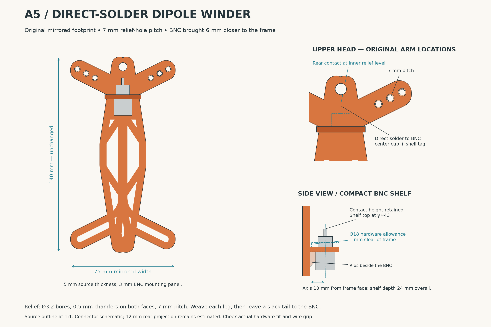

# Dipole winder design references

These records preserve the accepted A5 layout and measurements of the original
K6ARK winder. The finished [parameterized SCAD project](../../../models/ham_radio/dipole_winder/README.md)
contains the current dimensions, printable STL, assembly instructions, and
validation results. Its default BNC cutout is now **10.1 mm**. Earlier concept
images, prompts, and superseded A1–A4 layouts remain recoverable from Git history.

## Accepted A5 layout

A5 established the **75 × 140 × 5 mm** mirrored source footprint, native horn
positions, Ø6 suspension eye, and three Ø3.2 strain-relief holes on each upper
arm at **7 mm pitch**, with 0.5 mm chamfers on both faces. Each wire passes
through the relief before a relaxed tail reaches the BNC center cup or shell
tag. The layout has no M3 studs or separate terminal hardware.

The BNC axis sits 10 mm in front of the frame, with a 24 mm overall shelf depth.
The shelf moves independently of the horns to put the estimated rear contact
at the inner relief-hole level. The 12 mm rear projection remains an estimate;
the finished model exposes it as a parameter for the actual connector.

- [Design notes](a5-design-notes.md) record the accepted layout assumptions.
- [Numeric layout](layout-a5.json) is the reference used by the default-model validator.
- [PNG](layout-a5.png) and [SVG](layout-a5.svg) show the dimensioned study.
- [Layout generator](layout_a5.py) reproduces these records from the original
  wireframe STL and imports [the source-analysis script](analyze_reference.py).

This is a historical layout snapshot. The SCAD project adds reviewed edge bevels,
fills five small central windows, and provides adjustable dimensions; consult
its documentation for the printable geometry and hardware fit status.

## Original geometry measurements

Both user-supplied STLs measure **140 × 54.043564 × 5 mm** and have the same
retention-arm directions. The solid model is translated −66 mm in Y relative
to the wireframe. The Downloads copy is byte-for-byte identical to the attached
wireframe, verified by SHA-256.

| Bay-facing straight surface | Acute angle to original long spine | Sweep from perpendicular |
| --- | ---: | ---: |
| Left arm | 63.575670° | 26.424330° |
| Right arm | 63.595345° | 26.404655° |

These are measured mesh angles. Straight external surface endpoints and
independent side-facet normals agree; triangulation diagonals and the back-rail
slope were excluded. The source-derived model retains the measured geometry
rather than rebuilding every arm at one averaged angle.

- [Measurement figure](reference-angles.png) and [SVG](reference-angles.svg).
- [Numeric results and provenance](reference-angles.json), including source hashes.
- [Reproducible analysis](analyze_reference.py); see its help for the two STL inputs.

The original winder is **K6ARK Wire Antenna Winder — UL Wireframe Model** by
**Adam Kimmerly (K6ARK)**, [Printables model 383037](https://www.printables.com/model/383037-k6ark-wire-antenna-winder-ul-wireframe-model).
See the project's [source attribution and upstream terms](../../../models/ham_radio/dipole_winder/NOTICE.md).
The source meshes were analyzed without modification.
