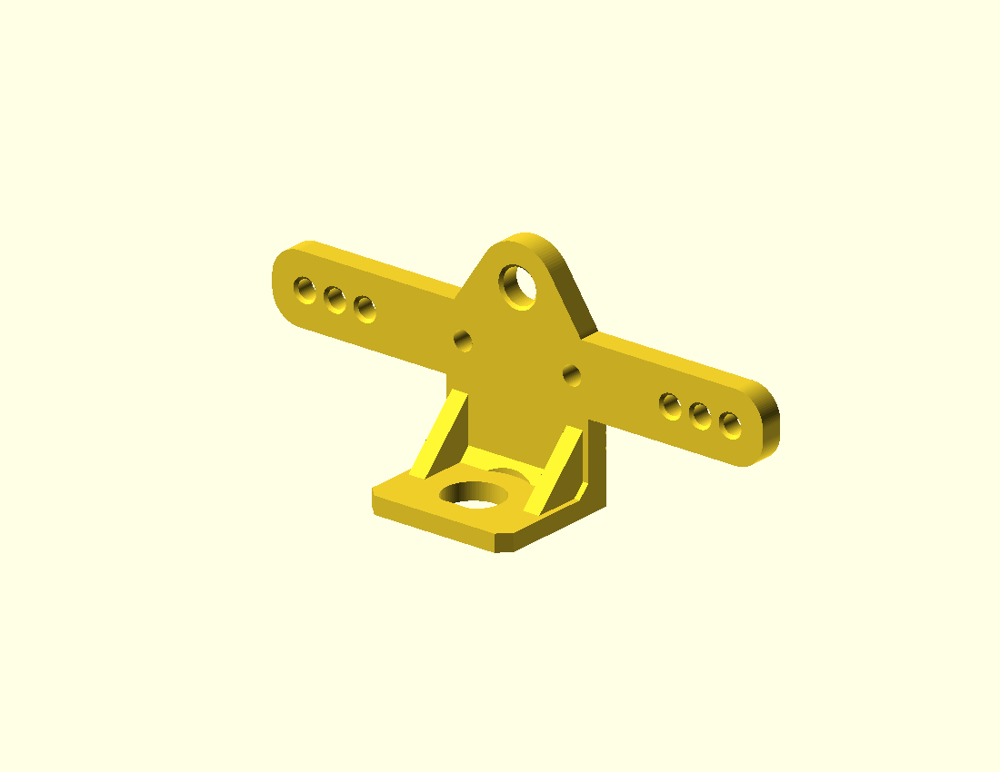

# BNC Dipole Center

**Download on Printables:** [BNC Dipole Center](https://www.printables.com/model/1838086-bnc-dipole-center).

A compact coax-fed dipole center with a downward-facing BNC, two M3 terminal
posts, and three strain-relief holes for each antenna leg. Linking happens in
the antenna wire, so this center is useful for both linked and ordinary dipoles.
It contains no balun; use a separate feedpoint choke as needed.

## Quick start

Print the supplied STL from Printables at 100% scale, broad back flat on the bed
and BNC shelf upright. Suggested starting settings: PETG, 0.20 mm layers,
5 walls, 100% infill. Use the
[Amphenol RF 31-221-RFX](https://www.digikey.com/en/products/detail/amphenol-rf/31-221-RFX/100648),
small ring terminals such as Panduit P22-6R-M, and M3 washers about 7 mm in diameter.
The front is the BNC shelf side. Weave the wire before attaching its ring, leave
slack at the terminal, and tug-check the weave. Dry-fit the connector and check
continuity from center to one leg and shell to the other, with no short between them.

For integrated wire storage, see [BNC Dipole Center on Winder](https://www.printables.com/model/1838087-bnc-dipole-center-on-winder).

**Status, 9 September 2026:** the original design printed successfully and felt
sturdy during handling. BNC and terminal hardware fit remains pending. This
widened version and its root reinforcement have not been printed or load-tested.



## Geometry and revision

| Feature | Default |
| --- | --- |
| Width × operating height × depth | 90 × 39 × 23 mm |
| Backplate thickness | 4 mm |
| BNC mounting shelf | 26 mm wide, 3 mm thick |
| BNC cutout | 9.9 mm D-hole, flat uppermost during printing |
| Terminal holes | Two 3.4 mm holes, 20 mm apart |
| Wire holes | Three 3.2 mm holes per side, 5.5 mm pitch |
| Terminal to innermost wire-hole centers | 18 mm |
| Suspension hole | 6 mm |
| Existing corner ribs | Two triangular ribs, each 3 mm thick |
| Added internal root ramp | 2 mm rise and run, with BNC hardware clearance |

The first print showed a horizontal line across the outside of the BNC shelf,
near the top of the 4 mm backplate. The original mesh has no modeled seam or
gap there: the shelf extends through the backplate and joins it with overlapping
volume. A print artifact where the broad plate ends and the much smaller upright
section continues is a plausible explanation, not a confirmed diagnosis from
the photograph.

The root reinforcement adds a triangular heel across the inside of that joint.
An 18 mm diameter clearance cylinder around the BNC axis is removed **from the ramp only**,
preserving the circular hardware space between the ribs. The shelf's mounting
surfaces, 3 mm panel thickness, connector cutout, and terminal coordinates stay
unchanged. The ramp adds material at the root; it does not remove the overall
change in printed layer area or promise to eliminate the visible line.

Each three-hole wire group moves 10 mm outward, placing its centers at
`x=±28`, `±33.5`, and `±39 mm`. The terminal centers remain at `x=±10 mm`; both
the terminals and wire holes remain at `y=21 mm`. Widening the body from 70 to
90 mm preserves the 5.5 mm wire-hole pitch and the 6 mm distance from each
outermost hole center to the end of the body. The extra span provides room for
the ring terminal barrel and a slack wire bend, as detailed below.

`root_ramp` accepts 0–2 mm; set it to `0` to disable the ramp on the widened body
for comparison. This does not reproduce the original 70 mm-wide model.
An additional assertion requires at least 1.2 mm of material between adjacent
wire-hole chamfers at the plate faces. The default settings leave 1.3 mm.
The model also requires at least 4 mm between the maximum-length Panduit barrel
opening and the innermost wire-hole chamfer.

Validation: the regenerated default STL is one watertight solid measuring
90 × 39 × 23 mm, with all ten holes open. A Boolean comparison with the previous
export confirms that the central BNC, ribs, root, terminal posts, and suspension
eye geometry is unchanged.

## Connector and wire hardware

The owned BNC is the **Amphenol RF 31-221-RFX**, which this model targets. Its
[manufacturer drawing](https://www.amphenolrf.com/en-us/assets/file/4065787961/)
specifies a 9.70 mm D-shaped cutout, 8.85 mm from the flat to the opposite edge,
and a maximum panel thickness of 3.30 mm. The default `bnc_clearance=0.10` adds
0.10 mm per side, giving a 9.90 mm cutout and 9.05 mm flat-to-edge dimension.
Adjust clearance or print the coupon; do not scale the whole model to fit it.

The planned antenna wire is **DX Engineering DXE-SANTW-500**, 26 AWG stranded
copper-clad steel with PE insulation. The owned **Panduit P22-6R-M** uninsulated
ring terminals cover 26–22 AWG and have a 3.86 mm hole that clears an M3 screw.
Their approximately 5.2 mm ring width suits the suggested 7 mm outside-diameter
M3 washers. Panduit specifies copper conductors; that does not establish a
qualified crimp on copper-clad steel. Make sample crimps with suitable small-wire
tooling and pull/flex-test them before wiring the antenna.

For a straight antenna-side approach, the
[Panduit drawing](https://rwjblue.com/downloads/radio/parts/panduit-p22-6r-m-datasheet.pdf)
gives 10.668 ± 0.508 mm from the ring center to the barrel opening. With an
18 mm terminal-to-hole center distance and a 2.1 mm wire-hole chamfer radius,
the widened layout leaves approximately **5.23 mm nominal, or 4.72 mm at the
maximum stated terminal length**, between the barrel opening and the nearest
chamfer edge. This is space for the wire to bend up from the hole while the ring
eye seats flat under its washer; it remains a prototype fit allowance that must
be checked with the actual terminal, wire, and fastener stack.

Suggested terminal hardware is two M3 × 16 mm screws, four nuts, and eight small
M3 washers; choose screw length after checking the actual assembled stack.
Two short insulated jumpers connect the BNC center and shell to separate posts.

1. Dry-fit the BNC, mounting nut, washer/tag, and coax plug. Its mating barrel
   points down in service, with its flange below the shelf and its solder contact
   and mounting nut/tag above it. Orient the shell solder tag outward between the
   ribs, away from the backplate. Check tool access and clearance before
   tightening; the complete hardware stack has not yet been physically checked.
2. Install each M3 screw from the back. A fixed base nut can retain the BNC
   jumper, with a second nut and washers clamping the antenna ring terminal.
   Avoid crushing the plastic while tightening.
3. **Weave each antenna wire through its holes before crimping the ring.** From
   the outermost hole inward, pass back-to-front, front-to-back, then
   back-to-front. The ring will not pass through a 3.2 mm hole. Leave slack between
   the innermost hole and the terminal so antenna tension goes into the weave.
4. Pull-test the strain relief with the actual wire. Ring terminals prevent
   unthreading the wire for a quick swap without removing the terminal.
5. Before connecting the radio, check continuity from the BNC center to one post
   and shell to the other, with no short between them. Support heavy coax or a
   choke separately so their weight does not load the connector.

## Printing and checking the visible line

Print with the **broad backplate flat on the bed and the BNC shelf standing up**,
as exported by `part="center"`. The coupon reproduces the upright D-hole and its
3 mm panel thickness, with nominal 9.7, 9.9, and 10.1 mm holes. Its upper flat
requires a short bridge. Fit the actual connector without forcing it and remove
print artifacts as needed.

The original suggested starting profile was plain PETG, 0.20 mm layers,
5 perimeters, and 100% infill. The successful print's exact material and slicer
profile were not recorded here, so those settings are not a validated recipe.

For a subsequent print, inspect the sliced layers around `z=4 mm`, including
outer-wall speed, layer time, and cooling changes as the backplate finishes.
Compare changes one at a time against the successful print's profile.
[Prusa's explanation of the Benchy hull line](https://help.prusa3d.com/article/the-benchy-hull-line_124745)
describes how changes in layer content, timing, and cooling can produce a visible
line without a corresponding seam in the CAD. It is background for this
hypothesis, not a diagnosis of this particular printer or print.

## Export

Run these commands from the repository root. STL files are generated outputs and
are ignored by the repository.

```sh
cd models/ham_radio/dipole_center
openscad -o dipole_center.stl dipole_center.scad
openscad -o dipole_center_BNC_9p7.stl -D 'bnc_clearance=0' dipole_center.scad
openscad -o dipole_center_BNC_9p9.stl -D 'bnc_clearance=0.10' dipole_center.scad
openscad -o dipole_center_BNC_10p1.stl -D 'bnc_clearance=0.20' dipole_center.scad
openscad -o BNC_upright_fit_test.stl -D 'part="coupon"' dipole_center.scad
openscad -o dipole_center_no_root.stl -D 'root_ramp=0' dipole_center.scad
```

`dipole_center_no_root.stl` is a widened version without the ramp for comparison
only. Use `dipole_center.stl` for the revised print.

`part="operating"` rotates the model into its service orientation for viewing;
use `part="center"` for the intended print orientation.

## Provenance

Imported from the ChatGPT-generated `linked_dipole_center_v2` download dated
9 September 2026, originally named `linked_dipole_center_v2.scad`. Renamed to
`dipole_center.scad` on import, with the internal root ramp and wire-web assertion,
then widened for ring-terminal clearance as described above. The supplied source
permits use, modification, and redistribution of its original geometry.
Referenced manufacturer drawings retain their own terms.

This is an open feedpoint with no established weatherproofing, mechanical load,
or RF power rating. Successful printing and mesh checks do not establish those
properties.

The original model is shared under [CC BY 4.0](https://creativecommons.org/licenses/by/4.0/).
