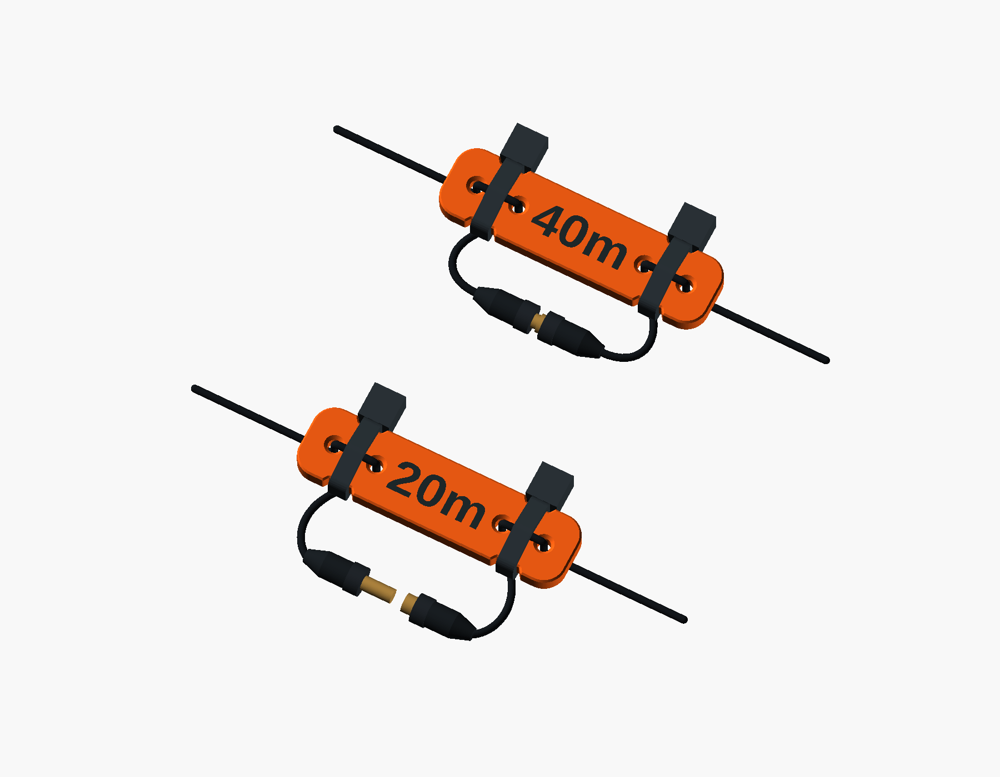

# Linked dipole link insulators

Small labeled insulators with two wire holes at each end and a narrowed seat
for a zip tie. The default body is **38 × 10 × 2.6 mm**. Connector tails stay
outside the plate, so the same print accommodates small bullet/banana
connectors or alligator clips.



## Print sets

- [40/30/20 starter set](links_40_30_20.stl): two of each, six links total.
- [All bands](links_all_bands.stl): two each of 80, 60, 40, 30, 20, 17, 15,
  12, 10, and 6 m; twenty links on an 80 × 136 mm plate.
- [40 m pair](links_40m_pair.stl): two links, also a useful first fit print.
- [OpenSCAD source](dipole_link.scad): self-contained, with custom labels and
  wire/tie sizing in the Customizer.

The downloadable STLs have recessed labels. Gallery images show the optional
flush second-color lettering. Hardware is schematic and is not in the STLs.

## Defaults and parameters

The starting fit is for [DX Engineering DXE-SANTW-500 wire](https://www.dxengineering.com/parts/dxe-santw-500),
26 AWG with nominal **0.041 in / 1.04 mm insulated diameter**. The default
**1.8 mm bore** includes room for threading and printing variation.

| Parameter | Default | Use |
| --- | --- | --- |
| `layout` | `"starter"` | `starter`, `full`, `pair`, or `single` |
| `pair_label` | `"40m"` | Arbitrary text for `pair` and `single` |
| `hole_d` | 1.8 mm | Actual modeled bore diameter; increase for thicker wire |
| `tie_width` | 2.5 mm | Zip-tie band width; the seat adds 0.5 mm clearance |
| `thickness` | 2.6 mm | Plate thickness |
| `min_length`, `min_width` | 38, 10 mm | Minimum body dimensions |
| `label_style` | `"recessed"` | `recessed`, `flush`, or `raised` |
| `label_size`, `label_depth` | 4.5, 0.4 mm | Letter height and recess/relief depth |
| `part` | `"complete"` | `complete`, `body`, or aligned `labels` geometry |

Larger holes, wider ties, and longer labels grow the body automatically.
Advanced controls cover chamfers, tie clearance/relief, hole spacing, and
layout spacing. Each default tie seat is 3 mm long with 0.75 mm relief on
each edge, leaving an 8.5 mm neck. Its head sits alongside the plate.

For a custom pair, set `layout = "pair"` and `pair_label = "17m"`, then
render and export. Labels identify whatever convention you choose for your
antenna; the model does not impose an open/closed meaning.

## Printing and assembly

Start with PETG, 0.2 mm layers, four walls, and 100% infill. Print flat with
the label facing up; no supports are needed. Thread the wire before fitting
connectors that cannot pass through the holes.

1. Bring each wire through its outer hole from the back to the label face.
2. Run it across the face and back through the adjacent inner hole.
3. Wrap a small zip tie around the narrowed seat and over this wire bridge.
   Put the head along the edge and tighten snugly without crushing the jacket.
4. Leave relaxed tails for the electrical connection. The render illustrates
   2 mm bullet connectors; clips or other connectors attach to the same tails.

For two colors, choose `label_style = "flush"`. Export once with
`part = "body"` and again with `part = "labels"`, keeping all other settings
identical. Import together as parts of one object, preserve their positions,
and assign the label part another filament. A complete STL does not retain
OpenSCAD preview colors. Recessed labels also work with paint fill.

These are CAD-checked prototypes; physical wire grip has not been tested.
Tug-test your wire and ties before use, keeping the connector tails slack.
The [design notes](design-notes.md) explain the retention assumptions.

## Regenerate

```sh
mise run dipole-link:check
mise run dipole-link:render
```

The check task exports the three STL sets and checks watertight solids,
quantities, bore sections, label clearance, parameter variants, and aligned
multicolor geometry. Results are recorded in [validation.json](validation.json).
The render task produces the three gallery PNGs from the actual SCAD geometry.

## License

[CC BY-NC-SA 4.0](https://creativecommons.org/licenses/by-nc-sa/4.0/).
