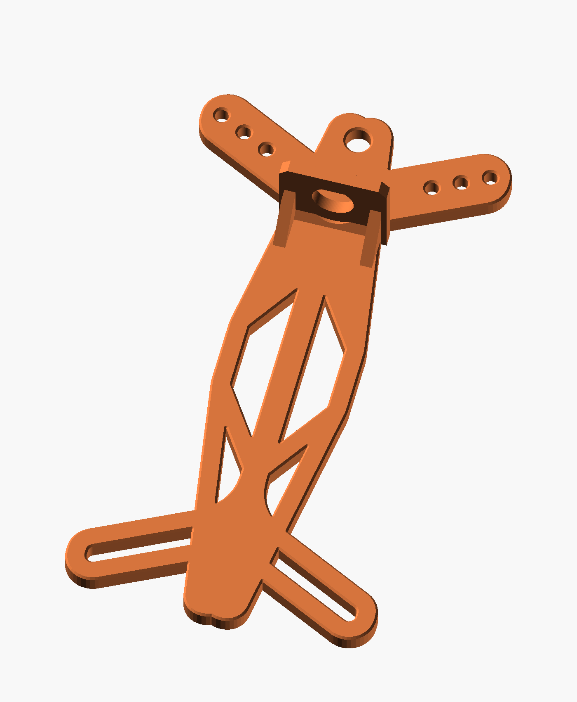
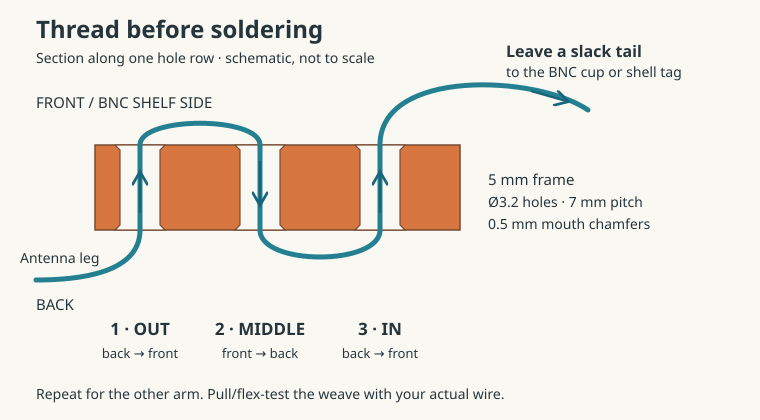

# Mirrored dipole winder

A direct-solder dipole center and two-sided wire winder based on the accepted
[A5 layout](../../../docs/concepts/2026-09-09-dipole-winder/layout-a5.png).
The default retains the native K6ARK horn positions and dimensions, with a compact
perpendicular shelf for the Amphenol RF **31-221-RFX** BNC bulkhead connector.
Each antenna leg has three chamfered strain-relief holes; there are no M3 studs.

**Print file:** [dipole_winder.stl](dipole_winder.stl).
**Editable model:** [dipole_winder.scad](dipole_winder.scad), with the adjacent
[embedded profile](reference_profile.scad) and [frame bevel](frame_bevel.scad).
No downloaded STL or Python runtime is needed to render the SCAD project.



The [front view](front.png) shows the retained winding outline. The exported
STL passed the geometry checks below: one watertight solid, 75 × 140 × 24 mm.

The [design and ergonomics review](design-review.md) led to 0.5 mm bevels on
both frame faces, five small central openings filled to reduce potential wire
snags, and a small strain-relief test piece. The default horns, BNC position,
suspension eye, and wire-hole dimensions remain as accepted in A5.

## Dimensions and fit

| Feature | Default |
| --- | ---: |
| Overall width × height × depth | 75 × 140 × 24 mm |
| Frame thickness | 5 mm |
| Frame perimeter/window edge bevels | 0.5 mm × 45°, both faces |
| Upper/lower horn sweep | Original approximately 26.4° |
| Suspension eye | Ø6 mm, center at Y63 |
| Wire holes | Three Ø3.2 mm per upper arm, 7 mm pitch |
| Wire-hole chamfers | 0.5 mm × 45°, both faces |
| Web between chamfer mouths | 2.8 mm |
| Shelf width × thickness | 26 × 3 mm |
| BNC cutout | D-shaped, Ø10.10 mm, flat-to-opposite edge 9.25 mm |
| BNC axis distance from frame front | 10 mm |
| Shelf top Y | 43.05 mm |
| Estimated rear contact Y | 55.05 mm, level with inner relief |

The BNC cutout has 0.20 mm allowance per side relative to the manufacturer’s
9.70 / 8.85 mm D-hole. The shelf is 3 mm thick, within the drawing’s 3.30 mm
panel limit. The flat faces upward during printing, with a roughly 5.61 mm
bridge and 4.8 mm of material above it. This default gives the first print more
tolerance for hole undersizing or bridge sag; the nut and washer clamp the
mount. Printed fit remains untested.

The **12 mm rear projection remains an estimate**, not an explicitly dimensioned
value in the [Amphenol drawing](https://mm.digikey.com/Volume0/opasdata/d220001/medias/docus/8637/031_221_rfx_customer_drawing.pdf).
If the assembled connector projects differently, set `bnc_rear_projection` to
the measured distance above the panel; the shelf moves to maintain contact
alignment while the horns stay fixed. `bnc_axis_from_frame` can increase the
depth if the actual plug or mounting stack needs more room.

The reserved Ø18 mm mounting-hardware envelope has 1 mm clearance to the frame.
The Ø12.7 mm barrel has 3.65 mm clearance. Two side ribs and a small trimmed heel
reinforce the shelf while preserving this envelope. Their footprint is clipped
to the frame so the heel does not start in midair beside the narrow spine.
Their bases extend into the full-width middle band beneath the face bevel,
avoiding a small unsupported ledge at the transition.
The 26 mm shelf itself is slightly wider than the spine at its root, as in A5;
its base starts on the print bed and stays within the overall winding dimensions.
The complete connector/tag/coax fit has not been physically checked.

The Ø3.2 holes accommodate the planned 26 AWG wire and the thin-jacketed 22 AWG
example below. Insulated diameter and grip vary with wire construction; check
the actual wire rather than AWG alone.

| Wire | Nominal insulated diameter | Basis |
| --- | ---: | --- |
| DX Engineering DXE-SANTW-500, 26 AWG | 1.02 mm | Repository design assumption; verify the actual wire |
| Davis RF POLYS-22, 22 AWG | 0.052 in (1.321 mm) | [Manufacturer table](https://www.davisrf.com/antenna-wire/polystealth.php) |

Fitting through the holes does not establish strain-relief grip; pull/flex-check
the three-hole weave with the intended wire.

## Customizer parameters

Open `dipole_winder.scad` in OpenSCAD and use the Customizer panel. Its visible
parameter groups expose the dimensions below; they can also be set with
command-line `-D` overrides.
All dimensions are millimetres. The defaults reproduce the checked-in
75 × 140 × 24 mm model, including its 10.1 mm BNC cutout.

| Parameter | Default | Controls |
| --- | ---: | --- |
| `arm_length` | 37.5 | Horizontal reach from the centerline to each arm tip; total width is twice this value |
| `frame_t` | 5 | Thickness of the flat winding frame |
| `relief_pitch` | 7 | Center-to-center distance along the three-hole strain-relief row |
| `relief_start_x` | 20 | Horizontal position of the innermost relief hole on each side |
| `wire_hole_d` | 3.2 | Through diameter of each strain-relief hole |
| `wire_chamfer` | 0.5 | 45° relief-hole chamfer on both faces |
| `hang_hole_d` | 6 | Hoisting-eye through diameter |
| `hang_chamfer` | 0.5 | Independent 45° hoisting-eye chamfer on both faces |
| `eye_y` | 63 | Hoisting-eye center along the vertical spine |
| `frame_edge_bevel` | 0.5 | Bevel around the exterior and retained windows on both frame faces |
| `close_snag_windows` | `true` | Fill the five small central openings; six larger windows remain |
| `bnc_hole_d` | 10.1 | Actual diameter of the circular part of the BNC cutout, including fit allowance |
| `bnc_flat_depth` | 0.85 | Depth removed from the top of that circle to form the anti-rotation flat |
| `shelf_t` | 3 | Connector mounting-panel thickness |
| `shelf_w` | 26 | Connector mounting-panel width |
| `bnc_axis_from_frame` | 10 | Connector-axis distance in front of the frame's front face |
| `bnc_rear_projection` | 12 | Estimated rear contact projection from the installed panel |
| `hardware_keepout_d` | 18 | Circular mounting-hardware space kept clear of the reinforcement |
| `rib_t` | 3 | Thickness of each reinforcing rib |
| `rib_run` | 10 | Rib attachment length below the mounting panel |

Changing `arm_length` translates all four rounded tips along their original
upper/lower sweeps. The roots, central spine, and tip radii retain their native
shape; the straight arm sides lengthen or shorten. The default horizontal reach
is 37.5 mm. Longer arms can also increase the overall height beyond 140 mm as
the tips move outward and upward/downward along the sweep.

The relief row follows the upper arm's measured 26.404655° sweep. Changing
`relief_start_x` also moves its Y position along that line and moves the BNC
panel to keep the estimated rear contact level with the inner relief hole.
Changing `relief_pitch` spaces the two outer holes from that anchor. For a
wider row, `arm_length=42` with `relief_pitch=8` provides more room around the
outer hole while retaining all other defaults.

`bnc_hole_d` replaces the previous `bnc_clearance` setting with the finished
cutout diameter. Its flat-to-opposite distance is
`bnc_hole_d - bnc_flat_depth`, giving 9.25 mm by default. Increase the diameter
for more printing allowance while retaining the flat depth for the same
connector. The shelf depth follows
`frame_t + bnc_axis_from_frame + hardware_keepout_d/2`. These connector
dimensions remain specific to the 31-221-RFX and the reserved hardware space;
printed and assembled fit remains untested.

Parameter combinations must retain at least 2 mm of material between relief
chamfer mouths and at least 2 mm from each chamfer mouth to the beveled frame
edge or a retained window. Assertions inspect the actual modified outline and
also protect the mounting panel and hardware clearance. A setting that removes
too much material stops rendering with an explanation. Increasing hole size
or pitch may therefore require longer arms or a change to the row position.

## Printing and assembly

The STL is already oriented with its **broad back flat at Z=0** and the BNC shelf
standing upright. Import it in millimetres at 100% scale. Supports are not
intended; inspect the D-hole bridge in the slicer. As a starting profile, the
dipole-center notes suggest PETG, 0.20 mm layers, five perimeters, and 100% infill;
these are starting settings, and this winder has not yet been printed or load-tested.

An optional upright fit coupon is available with `part="coupon"`. It has the
same panel thickness and print orientation. Its three labeled D-holes use
`bnc_hole_d - 0.4`, `bnc_hole_d - 0.2`, and `bnc_hole_d`, with the selected
flat depth: 9.7, 9.9, and 10.1 mm at the defaults. Use the same material/profile
to choose `bnc_hole_d`. Adjust that parameter rather than scaling the winder.
`part="frame"` displays the frame alone. `show_hardware=true` adds a schematic
connector in F5 preview only and
never exports metal hardware into the STL. Its [assembly preview](assembly.png)
also shows a shell tag pointing away from the frame and illustrative relaxed
wire tails; those shapes are not a manufacturer fit model.

Use `part="relief_coupon"` to print a small section of the actual upper arm,
including all three holes, their chamfers, the selected plate thickness, and
its beveled outer edge. The crop follows changes to the arm and hole row.
Weave the intended wire, hold the two straight crop edges, and pull the
antenna side while checking that the inner tail stays relaxed. Test before
soldering; a sample that slips calls for a relief change before use. This coupon
checks threading and grip, not the complete frame’s hanging strength.

`frame_edge_bevel=0` disables the new perimeter bevel, and
`close_snag_windows=false` restores the five small native windows. The default
keeps the six larger wireframe and horn windows open.

1. Remove printing burrs, especially at the winding edges and chamfered holes.
2. Thread the hanging cord first and keep its knot behind the plate, away from
   the solder contacts. Weave each antenna leg through the three holes from
   outside inward: back-to-front, front-to-back, then back-to-front.
3. Dry-fit the BNC with its barrel pointing down in service and rear contact
   toward the hanging eye. Point the shell solder tag away from the frame.
   Check nut access and fit with the actual coax plug before tightening.
4. Leave a relaxed insulated tail from each inner hole to the center cup or shell
   solder tag. Arrange the weave to take antenna tension while the solder joints
   retain slack; verify this with the pull/flex check below.
5. Pull/flex-check the relief, check center-to-one-leg and shell-to-other-leg
   continuity, and check for a center-to-shell short before use. Check winding
   clearance with the intended wire length and the actual connector fitted.



The frame stores two antenna legs. Fully deploy them for use; stored turns are
not a validated band-selection arrangement. This model contains no balun/choke.

## Export and verification

Run from this directory with OpenSCAD on PATH:

```sh
openscad --hardwarnings --export-format binstl -o dipole_winder.stl dipole_winder.scad
openscad --hardwarnings --export-format binstl -D 'part="coupon"' -o BNC_upright_fit_test.stl dipole_winder.scad
openscad --hardwarnings --export-format binstl -D 'part="relief_coupon"' -o wire_relief_test.stl dipole_winder.scad
openscad --hardwarnings --export-format binstl -D 'arm_length=42' -D 'relief_pitch=8' -o dipole_winder_longer_arms.stl dipole_winder.scad
openscad --hardwarnings --export-format binstl -D 'bnc_hole_d=10.2' -o dipole_winder_BNC_10p2.stl dipole_winder.scad
```

The main binary STL is checked in alongside the source so it can be downloaded
directly. Other generated STL variants follow the repository’s usual ignore rule.

[validate.py](validate.py) inspects the default exported mesh sections and
compares the frame with the accepted A5 geometry and the explicit review changes.
It checks manifoldness, connectedness, dimensions, open holes, both hole-chamfer faces,
seven sections across the frame bevels, retained native boundaries, the D-cutout
and reinforcement clearance. The saved results are in [validation.json](validation.json).
See the script’s docstring for its `uv` command and optional original-source check.

[validate_parameters.py](validate_parameters.py) exports representative parameter
combinations and both adaptive coupons, measures the resulting geometry, and
checks that invalid settings fail with the expected assertions. Results are saved in
[parameter-validation.json](parameter-validation.json). This complements the
strict default-geometry check; a customized STL is expected to differ from A5.

## Reference geometry and provenance

The silhouette is rotated and mirrored at scale 1, with upper openings filled
for the new holes. The embedded source profile retains all 11 real lower/central
windows and removes only six floating-point microholes. The default ergonomic
variant fills five small windows (IDs 4, 5, 6, 9, 10; 29.03 mm² combined) and
leaves six larger windows. Two narrow slots were only 1.14 mm wide and the
central diamond was 1.67 mm wide, so they could catch the intended fine wire.
Filling them is an ergonomic choice, not a repair to the valid source mesh.

At the defaults, the original exterior and retained windows match within
0.000003 mm through the central 4 mm of thickness. The 0.5 mm face bevels retreat inward at both faces;
they do not expand the frame or relocate the horns. This replaces the first
version’s square extrusion edges with a small bevel rather than reproducing
the original source’s rounded cross-section.

[generate_reference_profile.py](generate_reference_profile.py) can regenerate
the embedded polygon from the unmodified source STL:

```sh
uv run --no-project --with shapely python generate_reference_profile.py /path/to/newWinder_wireframe.stl
```

Source identity is checked by SHA-256. The actual model remains portable because
the resulting polygon is checked in. It exports `reference_points()`,
`reference_paths()`, and `reference_frame_2d()` for the model and its clearance
checks; zero arm extension reproduces the original embedded coordinates.
The original winder is by **Adam Kimmerly (K6ARK)**; see [NOTICE.md](NOTICE.md)
for attribution and upstream terms.
