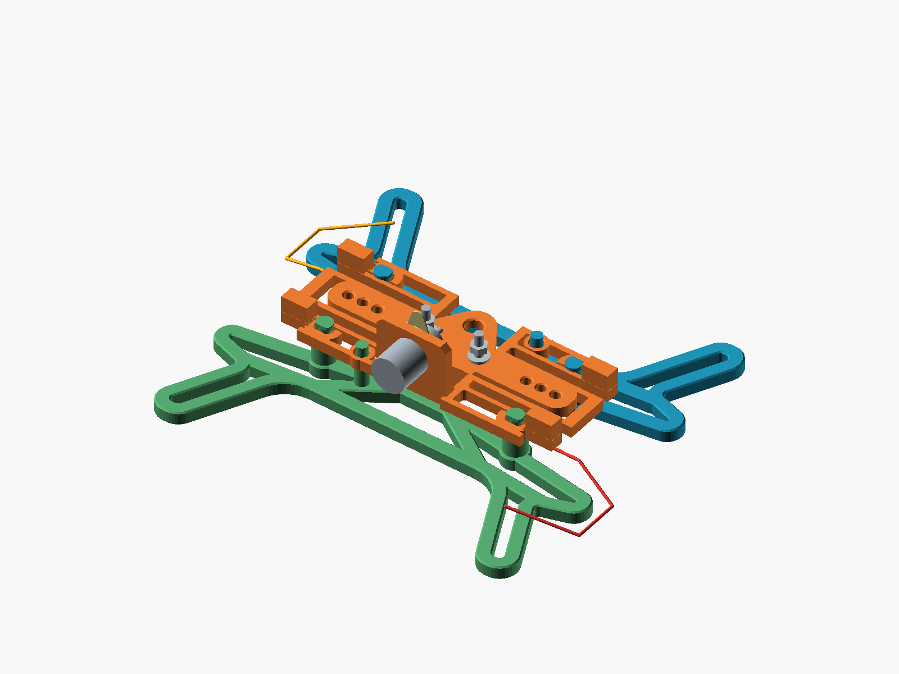
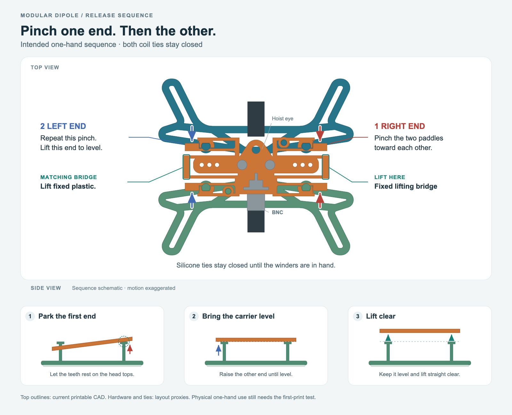

# Modular dipole center with removable winders

Two identical K6ARK-style winders dock to the center with **four retained studs**.
With the BNC at the bottom and the hoist eye at the top, pinch the upper and
lower orange tabs on the **right** to
release the right stud of **both** winders. The matching left pair releases
their left studs. The two winders remain identical prints.

The release uses **one hand, one end at a time**. After lifting the released end
clear, its tabs return above the broad, flat stud tops and the center rests on
those heads. This holds the first end open while the same hand changes ends.

Print the [complete three-piece plate](print_layout.stl), or one
[center](center.stl) and two copies of the [winder](winder.stl).

**Accepted by the independent critic for printing and physical trials.** CAD
checks pass for both presets and both release orders, including individual
support contacts and 264 independently sampled parked configurations. Results
are in [validation.json](validation.json) and the reviews below.
Hand operation, glove fit and durability still require the printed trial.



## The one-hand sequence to test

Begin with the tied winders supported on a surface or your lap. The surface
supports their weight; it does not by itself restrain them against lifting.

1. Pinch the right upper/lower tabs inward with thumb and forefinger.
2. Use another finger on the **fixed outer lifting edge**, between those tabs,
   to lift the right end of the center. Keep the tied winders down with the
   same hand or let their weight provide the reaction if sufficient.
3. Release the pinch and lower that end gently onto the flat head tops. It
   should remain visibly raised. The left end remains retained.
4. Move the same hand to the left, pinch its tabs, and lift the fixed left edge
   until the center is level. Then lift the center clear of the guide pins.
5. Secure the center low at the mast, open one winder's silicone tie, and walk
   that leg outward. Repeat for the other leg, then hoist the antenna.

Both left-first and right-first operation must work. The resting position is
for handling, not transport. The full assembly is secured only when all four
heads are through the openings and all four catches have returned beneath them.

The CAD model can establish contact, capture and clearance. **Whether the
winders stay down during that initial one-hand lift, and whether the gesture
works in gloves, require the physical trial.** Free-air one-hand use is not yet
demonstrated. The fixed lifting edges keep lift force off the flexible tabs.

The raised finger faces are 10 mm high. Their contact span is approximately
34 mm at rest; a full paired pinch closes it by about 6.3 mm. The intended
contact is on the upper part of those faces, above the wound wire. The lower
4 mm plate edges do not provide the same loaded-finger clearance.

The guide-clearance proof allows a small sideways settling movement during
the first lift. Support the winders so they can move slightly instead of
clamping them immovably. The physical trial must confirm that this feels like
an easy guided release, without needing a second hand or deliberate jiggling.



## Reassembly

**Pinch to seat each end**, then release the tabs under the heads. A straight
push alone is
not the intended docking action. Close each winder's silicone tie first,
align the four studs, and keep the relaxed antenna tails outside the slots
and away from the lifting edges. Check each end with a gentle pull.

Two additional smooth guide pins maintain alignment while the ends lift. They
do not retain the center by friction; the four headed studs provide retention.

The two ties retain the wound wire. The four catches retain the three printed
parts, so a whole-bundle tie is optional backup rather than a required closure.

## Print and fit

The default print set is **one center and two identical 40 m winders**.
Use matching winder heights. These are the parts selected for the first full
prototype print on 10 September 2026.

| Item | File | Quantity |
| --- | --- | ---: |
| Paired release coupon | [fit_coupon.stl](fit_coupon.stl) | 1 plate |
| Center, selected 10.1 mm BNC opening | [center.stl](center.stl) | 1 |
| Default 40 m space winder | [winder.stl](winder.stl) | 2 identical |
| Optional 80 m space winder | [winder_80m.stl](winder_80m.stl) | 2 identical |
| Complete default plate | [print_layout.stl](print_layout.stl) | 1 |
| Complete 80 m plate | [print_layout_80m.stl](print_layout_80m.stl) | 1 |

Choose separate files or the complete plate. Parts are separately printed and
assembled; this is **not a print-in-place assembly**. The flexible tabs are part
of the center print and bend in the bed's XY plane. The default BNC clearance
remains 0.20 mm per side: 10.1 mm diameter and 9.25 mm from the D-flat to the
opposite edge. Both wire-space presets use the same center.

Start with the paired coupon. Check all slots are open and the flat head
undersides print cleanly. Its two catches should release with one comfortable
pinch and return freely. Initial PETG settings remain 0.20 mm layers, five walls
and solid infill, subject to the actual printer and coupon. No release force,
fatigue life or cold-weather material performance has been measured.

Then print the complete assembly and test the one-hand sequence while both
winders carry the actual wire and silicone ties. A coupon checks the local
latch; it cannot establish the four-stud peel or a comfortable full grip.

## Wire, ties and space

The K6ARK winding region and upper central tie brace remain at original scale.
Wind **tip first**, working toward the center, so the center end is outside the
figure-eight coil for deployment. Leave roughly 100–150 mm of relaxed tail,
adjusted to the final hardware and release path. The short UMUST ties stay
captive around each winder's upper brace and close around the wound wire before
docking. Button and strap dimensions remain provisional until measured.

The default preset reserves 5 mm of wire buildup on each face; the 80 m preset
reserves 8 mm. These are space assumptions, **not verified wire capacities**.
Trial about 10.5 m per leg for the default use and about 21 m for an 80 m storage
test; these figures are not antenna cutting lengths. Measure the actual maximum
bundle depth and adjust `wire_face_bulge` accordingly.

The winders sit 26 mm either side of the centerline to leave space for the
inward release tongues and finger access.

| Exported estimate | 40 m space | 80 m space |
| --- | ---: | ---: |
| Bare assembled packet | 140 × 127 × 36 mm | 140 × 127 × 39 mm |
| Reserved wire envelope, before hardware and ties | 150 × 137 × 41 mm | 150 × 137 × 47 mm |
| Three printed parts, solid PETG estimate | 50.0 g | 50.9 g |

Mass uses 1.27 g/cm³ and excludes wire, metal and silicone. Actual slicer mass
will differ. Both complete print layouts occupy about 140 × 179.54 mm; recenter
in the slicer and allow any required brim space, or use the separate files.

All four heads have intentional axial
clearance so the opposite end can tilt during release; inspect transport play
on the print rather than assuming a tight, silent fit.

## Reproduce and review

Run these commands from the repository checkout. The STL bundle also includes
the editable CAD source and the completed proof reports. The package task
writes `modular-dipole-STLs.zip`; generated ZIPs are not committed.

```sh
mise run modular-dipole:check
# Optionally also compare against your original K6ARK STL:
# mise run modular-dipole:check -- --source /path/to/K6ARK_Wire_Winder.stl
mise run modular-dipole:render
mise run modular-dipole:package
```

[Source](modular_dipole.scad), [digital checks](validation.json),
[design and ergonomics review](review/DESIGN.md).
See [NOTICE.md](NOTICE.md) for the upstream model attribution and licensing.
