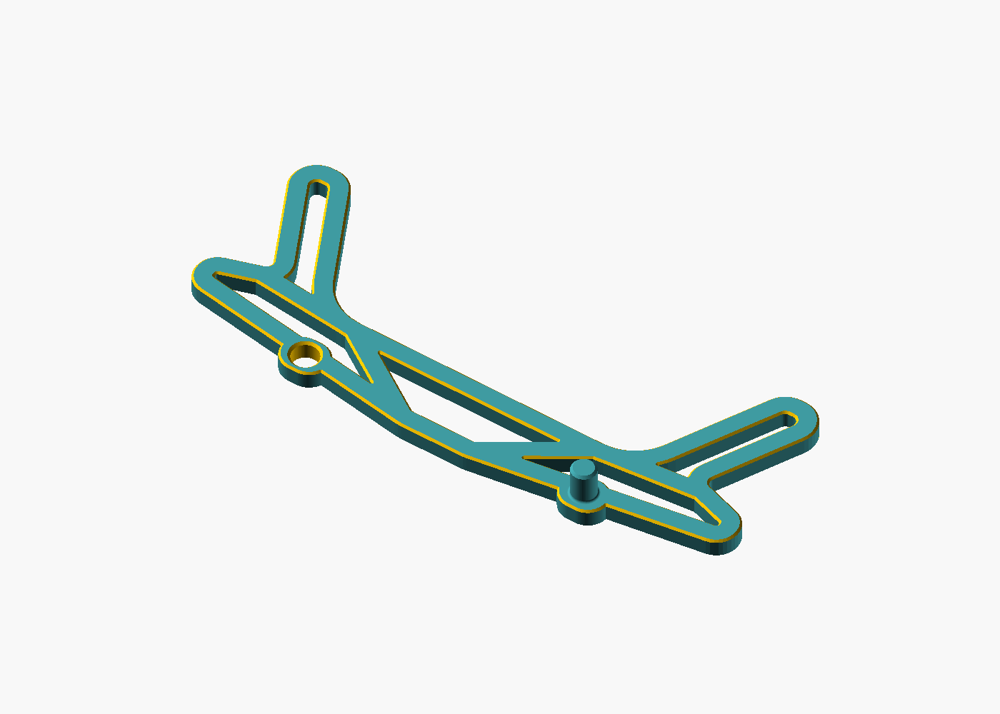
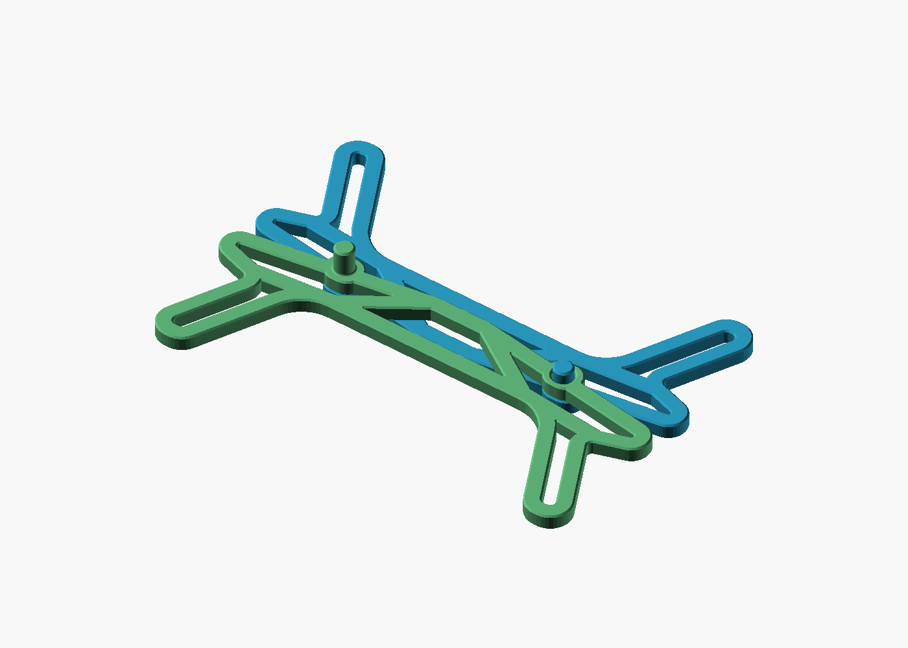
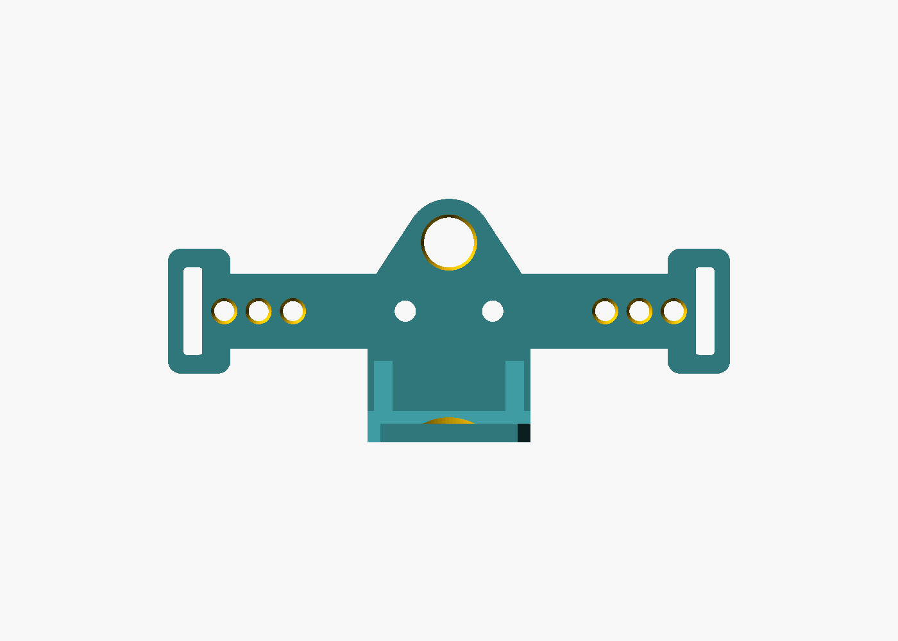
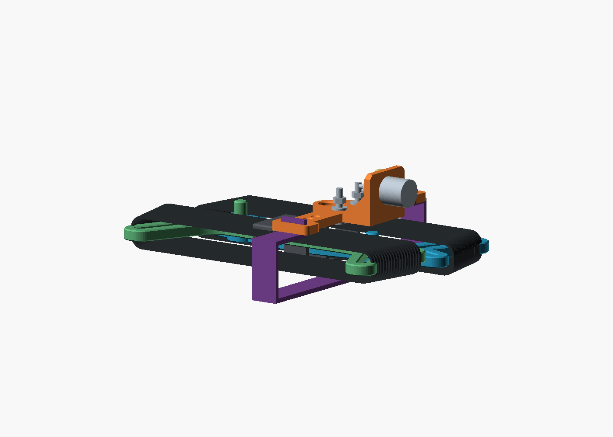
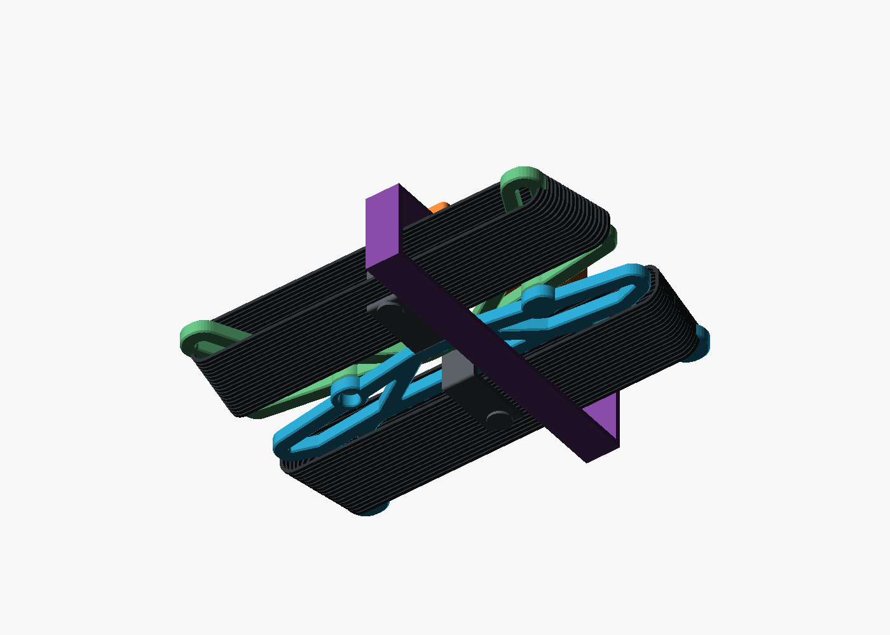
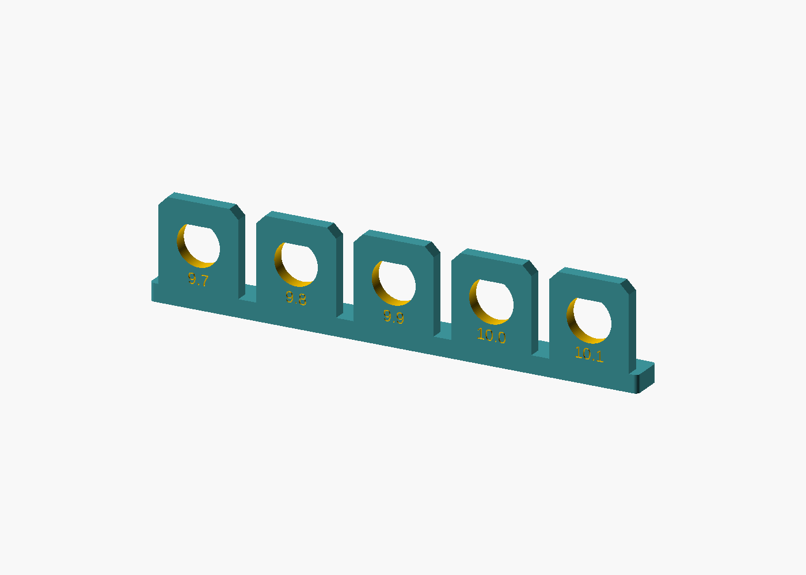
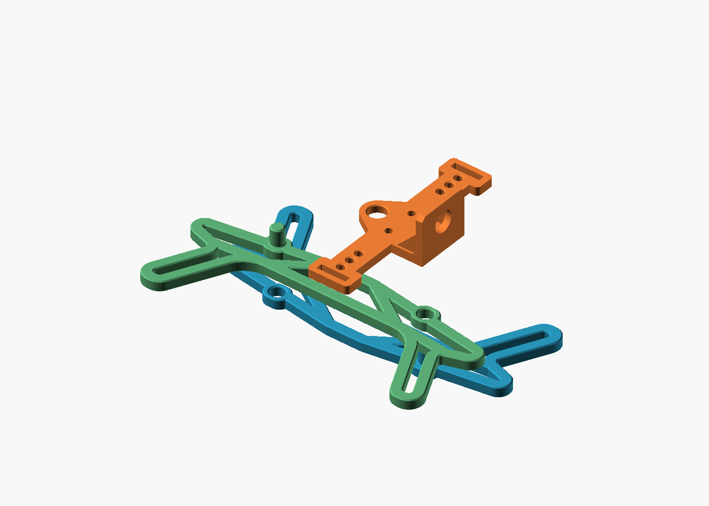
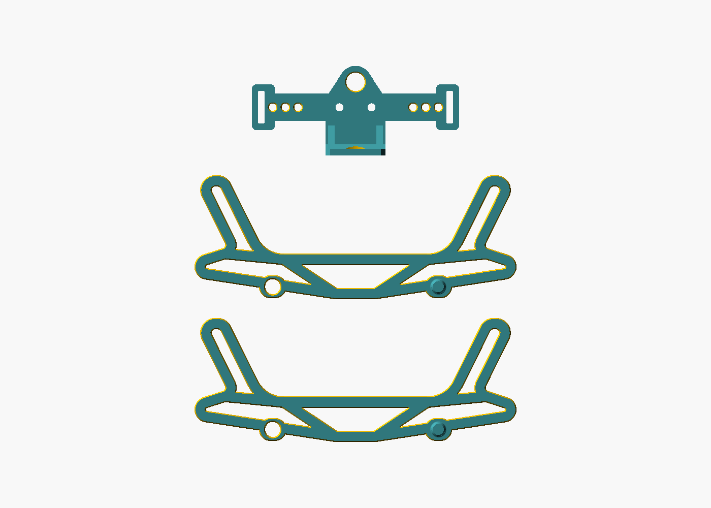

# Nesting dipole

Two separate leg winders pack together at their spines, with their wire
bundles on opposite sides. Print **two identical winders and one center**.
Each winder has one stud and one hole at the original spine stations. A
compact crosswise center has strap slots in line with its wire bar. A short
strap through those slots holds the bundle together around the back.

This replaces the earlier four-post center arrangement in the same model.
It remains independent of [Modular dipole](../modular_dipole/README.md) and its
retaining clips. The editable source is [nesting_dipole.scad](nesting_dipole.scad).
The winding profile is an independent snapshot; the original dipole center
and frame bevel remain shared helpers.



The [one-page flyer](marketing/README.md) explains the packing and deployment
idea with a product illustration and a simple walk-out diagram.

## How the pieces meet

The original station centers stay at **X = ±36 mm, Y = −11 mm**. The
**6 mm stud** remains at X = +36 mm; the station at X = −36 mm becomes a
**6.5 mm round hole** at the default clearance. There is no new central tongue.
Both stations retain the earlier 12 × 10 mm pads and their 72 mm spacing.

Keep both winders' studs pointing up. Turn one winder 180 degrees in the
plane of the frame, then place its spine over the other spine. Their winding
regions extend in opposite directions. The **lower stud enters the upper
winder's hole**; the upper stud remains exposed and unused. The overlapping
spines contact directly, without a standoff.

The single engaged stud locates the pair but allows it to pivot. The rear
strap supplies retention and holds the center in its packing position.



Each stud rises **8 mm above its 5 mm frame**, 1 mm taller than the earlier
7 mm stud. The engaged stud passes through the upper frame and projects
**3 mm beyond it**. Its rounded root and tip chamfer are both 0.6 mm.
The receiving hole has 0.6 mm relief at its printed top face and a 0.4 mm
entry chamfer at its printed bottom face.

The center measures **90 × 39 × 23 mm**. Its **8 mm hoist eye** gives more
room for suspension clips. The strap slots sit in line with the terminal
and wire holes, so the strap pulls through the center bar. Each end widens
symmetrically around its slot while staying within the 90 mm overall width.

All nine functional plate holes remain, with a revised layout: the two M3
terminal centers move to **X = ±7 mm**, and the three wire holes on each side
move to **X = ±25, ±30.5 and ±36 mm**. Moving both groups inward together
preserves the 18 mm terminal-to-inner-hole spacing and 4.724 mm of wire-entry
space at the maximum specified ring-terminal length, as described in the
[dipole center guide](../dipole_center/README.md).
The BNC shelf structure, ribs and shelf-root reinforcement are unchanged;
the default D-shaped opening is now 9.9 mm. There are no center docking holes.



The packing views put the center crosswise above the wire, with 2 mm reserved
for the strap to turn beneath it. Its illustrated plate height is 17 mm for
the 40m reserve or 20 mm for the 80m reserve. These are packing positions,
not printed standoffs. The actual center can tilt as the strap settles against
the wound coils.

Use the matching one-stud/one-hole winders; the earlier two-stud winders
cannot make this joint. This revision changes the center and packing
arrangement while retaining the current winder geometry.



## The short rear strap

The center bar ends have **14 × 3 mm slots**, intended for roughly **12.7 mm
(half-inch) wide hook-and-loop strap up to 2 mm thick**. Choose end closures
or hook patches that engage the strap body when folded back. Check the
actual strip before cutting; a fold alone does not close every tape style.
A silicone tie can also be tried if its body, ends and closure fit the slots.

Thread one end through each center slot. Beneath the center, run the strap
outward over the coils before turning it down around the back of both
winders. Fold the ends back and fasten them at the slots. The strap makes an
open U: it does **not** cross the front of the center or make a full lap
around the bundle. Trim it after trying the actual wound coils, leaving
enough material for both end closures.

The route reserves room for a 12.7 × 2 mm strip but does not set its cut
length or closure overlap. Individual coil ties retain each leg's wound wire;
the rear strap holds the separate center and winders together.

At the default dimensions, each slot retains 2.5 mm of material to the outer
edge, 3 mm at its ends and a 1.4 mm web to the nearest wire-hole chamfer. The
enlarged hoist eye retains a 2.5 mm wall around its chamfered mouth.



## Print and use

Start with [bnc_fit_coupon.stl](bnc_fit_coupon.stl) to size the connector
opening before printing the center. Its five labeled D-shaped openings are
**9.7, 9.8, 9.9, 10.0 and 10.1 mm**. The holes stand upright in 3 mm walls,
matching the center's BNC shelf thickness, hole height and anti-rotation flat.
Keep the common foot on the bed; do not lay the coupon on its hole face.
Use the same material, layer height, orientation and slicer compensation as
the center. Check your actual connector in each opening, then use the smallest
size that slides in without force and lets the flat seat correctly.

Set **`bnc_hole_d` to the winning label**, choose `part="center"`, render and
export a fresh STL. The default is now **9.9 mm**, reduced from the original
10.1 mm after a loose printed fit. That is a starting point, not a measured
fit for every printer or connector. Fine adjustments of 0.05 mm are available.
Changing this setting preserves the D-flat and only changes the BNC opening;
do not scale the whole center in the slicer to correct the hole.



Print the broad backs of the center and both winders flat on the bed. The
supplied layouts use this orientation. Test the bare winders first, with the
upper winder's back against the lower winder's printed top. To separate them,
lift the upper winder a little more than 8 mm off the lower stud.

The intended packing sequence is to wind each leg independently, join the
winders, place the center crosswise with relaxed wire tails, and connect the
short rear strap through its end slots. Check the assembled bundle with the
actual wire and ties before relying on it for a trip.
For deployment, release the strap, lift away the center, separate the winders,
and walk out each leg from the mast before hoisting the center.



| File | Print quantity / purpose |
| --- | --- |
| [center.stl](center.stl) | One crosswise center with end strap slots |
| [winder.stl](winder.stl) | Two identical winders, each with one stud and one socket |
| [winder_80m.stl](winder_80m.stl) | Same geometry as `winder.stl`; retained filename |
| [print_layout.stl](print_layout.stl) | Complete three-piece layout |
| [print_layout_80m.stl](print_layout_80m.stl) | Same geometry as `print_layout.stl`; retained filename |
| [bnc_fit_coupon.stl](bnc_fit_coupon.stl) | Five labeled BNC openings; print once to choose `bnc_hole_d` |

The [Printables listing](https://www.printables.com/model/1844842-nesting-bnc-dipole-center-and-winders)
includes the center, winder, complete layout, BNC coupon, source ZIP and flyer.
The older [winder fit coupon](fit_coupon.stl) remains a repository development
aid, not a Printables download. Its two matching strips reproduce the full
72 mm station spacing. Use the default 0.25 mm stud clearance per side;
0.15 mm can interfere at the rounded root and is not recommended.



## Parameters

Open the SCAD file in OpenSCAD's Customizer. Dimensions are millimeters.

### Most useful adjustments

| To change… | Adjust | What to know |
| --- | --- | --- |
| BNC connector fit | `bnc_hole_d` | Default 9.9; 9.7–10.2 in 0.05 steps. Print the BNC coupon first. Smaller reduces play; larger eases insertion. The circular diameter and anti-rotation flat move together. |
| Strap fit | `strap_slot_width`, `strap_slot_thickness` | Defaults 14 × 3; the first accepts the strap's width, the second its thickness. Leave room for threading. Wider thickness settings may require smaller wire holes/chamfers to preserve the adjacent web. |
| Wire threading | `wire_hole_d`, `wire_chamfer` | Defaults 3.2 and 0.5. Match insulated wire and smooth the hole mouths. The chamfer also applies to the hanging eye. |
| Terminal hardware fit | `terminal_hole_d` | Default 3.4 for M3 screws; reduce or enlarge the clearance hole without changing screw spacing. |
| Hanging clip fit | `hang_hole_d` | Default 8, range 6–8. Already at the largest supported size to preserve the eye's wall. |
| Winding space | `wing_length`, `winding_span` | Defaults 37.5 and 140. Enlarge the winding frame while keeping the spine mating stations fixed; check your printer's bed size. |
| Winder joint fit | `alignment_clearance`, `post_protrusion` | Defaults 0.25 per side and 3 beyond the other frame. Increase clearance if the joint binds; extra post length does not lock the bundle. |

For BNC fit, extract the source ZIP without changing its directory structure,
open `models/ham_radio/nesting_dipole/nesting_dipole.scad`, select **Center**
(`part="center"`) and enter the coupon's best size in **BNC fit**. Render (F6),
export as STL and slice at 100%. Existing STL downloads are fixed meshes;
editing the SCAD parameter does not modify a previously exported STL.
For example, a 10.0 mm choice can also be exported from the repository root:

```sh
openscad --backend=Manifold --hardwarnings \
  -D 'part="center"' -D 'bnc_hole_d=10.0' \
  -o center-bnc-10.0.stl models/ham_radio/nesting_dipole/nesting_dipole.scad
```

### Full parameter reference

| Parameter | Default | Meaning / range |
| --- | --- | --- |
| `part` | `print_layout` | `center`, `winder`, `assembled`, `winders`, `print_layout`, `exploded`, `bnc_fit_coupon`, `fit_coupon`, `wire_envelopes` |
| `bnc_hole_d` | 9.9 | Modeled circular diameter of the D-shaped BNC cutout; 9.7–10.2 in 0.05 steps |
| `preset` | `40m` | `40m` or `80m`; selects displayed coil buildup |
| `show_wire` | `false` | Show reserved coil space in assembly previews |
| `wing_length` | 37.5 | Native datum to horn-tip Y; 37.5–60 |
| `winding_span` | 140 | Lower outer-tip spacing; 140–200 |
| `post_protrusion` | 3 | Stud length beyond the other winder's frame; 2–5 |
| `alignment_clearance` | 0.25 | Clearance per side of the stud; 0.15–0.40 |
| `strap_slot_width` | 14 | Clear slot length for strap width; 10–20 |
| `strap_slot_thickness` | 3 | Clear slot width for strap thickness; 2–4 |
| `wire_face_bulge` | 0 | Auto 5/8 by preset; otherwise 2–12 per face |
| `wire_edge_bulge` | 5 | Reserved wire overhang around the winding region; 2–5 |
| `wire_hole_inner_x` | 25 | Centerline to first strain-relief hole; 24–30 |
| `wire_hole_pitch` | 5.5 | Pitch within each three-hole group; 4–6.5 |
| `wire_hole_d` | 3.2 | Strain-relief bore; 2.6–3.6 |
| `wire_chamfer` | 0.5 | Wire-hole and hoist-eye entry chamfer; 0–0.6 |
| `terminal_hole_x` | 7 | Centerline to each M3 terminal; 7–10 |
| `terminal_hole_d` | 3.4 | M3 clearance bore; 3.1–3.6 |
| `hang_hole_d` | 8 | Hoist-eye bore; 6–8 |

Stud height above the frame is `5 + post_protrusion`. The old
`alignment_slot_extra` parameter is removed: both winders use the same round
socket. Hole spacing and chamfers have combined material and terminal
clearance guards, so not every combination of individually allowed values fits.

Both wire-space presets produce the same printed parts with otherwise equal
settings. They reserve 5 mm or 8 mm of coil buildup per face; they do not
establish wire capacity. The reserves extend to opposite sides of the joined
spines; check the actual wound coils and ties against the packing views.
`preset`, `show_wire`, `wire_face_bulge` and `wire_edge_bulge` are packing-preview
controls, not ways to resize the printed winding frame.
`show_wire` appears in F5 preview; the reserved envelopes are omitted from
F6 renders and STL exports of the assembled model.

With the default wire-hole positions, bore and chamfer, strap-slot thicknesses
of 3.5 or 4 mm are rejected: the combined wall limit is 3.4 mm. A wider slot
requires a compatible smaller wire bore/chamfer or an adjusted hole layout.

`terminal_hole_x`, `wire_hole_inner_x` and `wire_hole_pitch` are advanced layout
controls. Moving the terminals and wire holes independently can consume the
ring-terminal entry space or the thin wall beside a strap slot. The assertions
reject combinations that violate those limits; prefer the default positions
for ordinary fit tuning.

Longer wings and wider spans preserve the original mating stations and enlarge
the print footprint. Extended horns can project beyond `winding_span`. The
center keeps its compact 90 mm width at the default settings.

## Regenerate and inspect

Run from the repository root:

```sh
mise run nesting-dipole:check
mise run nesting-dipole:render
```

The [CAD validation report](validation.json) separates bare-part checks from
loaded-fit observations. It checks watertight parts, the single engaged stud,
face contact, straight lift separation, the revised center hole layout,
preserved BNC shelf structure, adjustable D-shaped cutouts, strap-slot walls,
coupon interfaces and matching print layouts. It also checks
the conservative wire reserves and schematic hardware and strap routes.

The [BNC coupon preview](images/bnc_fit_coupon.png) shows the connector tests;
the [paired winder coupon preview](images/fit_coupon.png) is a development aid.
Bare assembly views omit wire. The [loaded view](images/loaded.png) and rear
view illustrate the separate coils and short strap path. Printed fit,
strength, loaded wire clearance and comfort in the hand still need prototype
trials.

Source attribution and remix terms are in [NOTICE.md](NOTICE.md).
